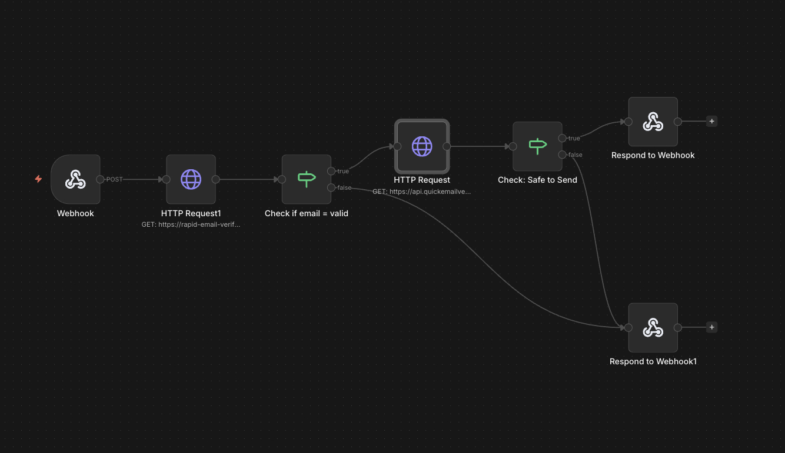

# Email Validator & Verifier

A contact form with **multi-layer server-side email verification**, powered by [n8n](https://n8n.io/).



<video src="demo.mp4" width="100%" controls poster="screenshot.jpg">
  Your browser doesn't support HTML video. <a href="demo.mp4">Download the demo video</a> instead.
</video>

## How It Works

```
User submits form
       ↓
  n8n Webhook ←────────── POST from frontend
       ↓
  Rapid Email Verifier API  →  (syntax, domain_exists, mx_records)
       ↓
  IF all three are true? ──No──→ Respond {success: false}
       │
      Yes
       ↓
  QuickEmailVerification API  →  (safe_to_send check)
       ↓
  safe_to_send == true? ──No──→ Respond {success: false}
       │
      Yes
       ↓
  Respond {success: true}
```

The form validates at two levels:

1. **Client-side** — basic email format check before submission
2. **Server-side (n8n)** — syntax validity, domain existence, MX records, and deep deliverability check

## Project Structure

```
├── frontend/
│   ├── index.html             # The contact form
│   └── config.example.js      # Configuration template (copy to config.js)
├── n8n-workflow/
│   └── verify-email.json      # n8n workflow (import into your n8n instance)
├── README.md
├── LICENSE
└── .gitignore
```

## Prerequisites

- An **n8n instance** (self-hosted or [n8n cloud](https://n8n.io/))
- API keys for:
  - [Rapid Email Verifier](https://rapid-email-verifier.fly.dev/) — syntax & DNS checks
  - [QuickEmailVerification](https://quickemailverification.com/) — deliverability check

## Setup

### 1. n8n Workflow

1. In your n8n instance, go to **Workflows → Import from File**
2. Select `n8n-workflow/verify-email.json`
3. Set the `QUICKEMAIL_API_KEY` environment variable in your n8n instance with your QuickEmailVerification API key
4. Activate the workflow
5. Copy the **Webhook URL** from the Webhook node

### 2. Frontend

1. Copy `frontend/config.example.js` to `frontend/config.js`
2. Paste your n8n webhook URL into `config.js`:
   ```js
   const CONFIG = {
       WEBHOOK_URL: "https://your-n8n-instance.com/webhook/your-webhook-id"
   };
   ```
3. Serve the `frontend/` folder with any static web server (or open `index.html` directly for testing)

> **Note:** `config.js` is gitignored so your webhook URL stays private. Only `config.example.js` is tracked in the repo.

## Configuration Reference

| Variable | Where to Set | Description |
|---|---|---|
| `QUICKEMAIL_API_KEY` | n8n environment variable | API key for QuickEmailVerification |
| `CONFIG.WEBHOOK_URL` | `frontend/config.js` | Your n8n webhook endpoint |

## License

MIT — see [LICENSE](LICENSE).
